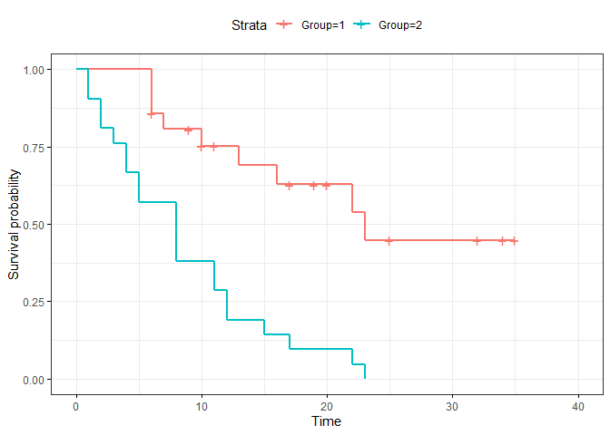
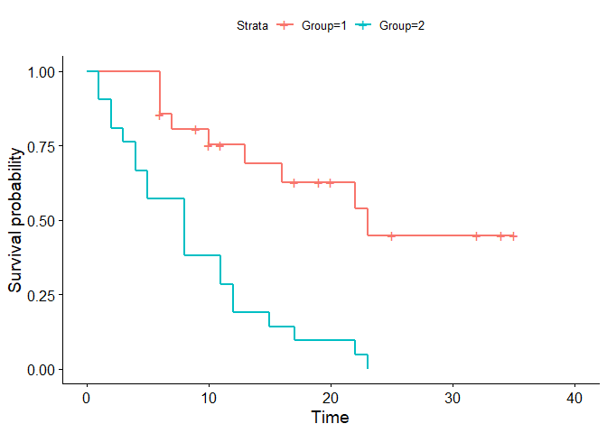
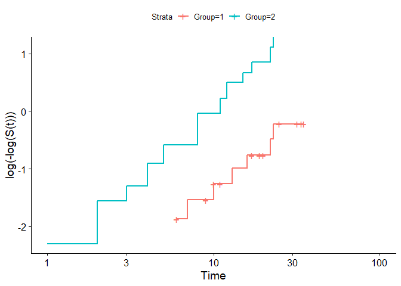
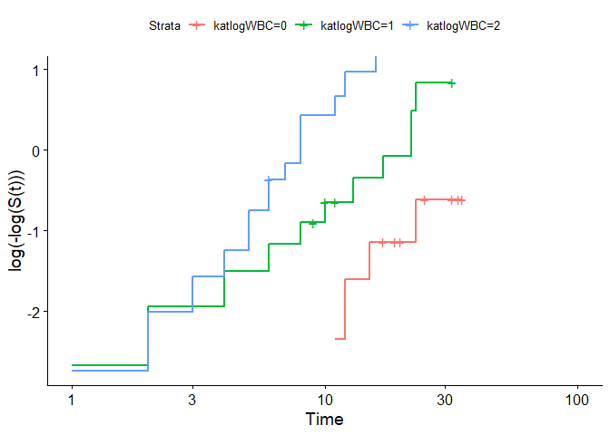
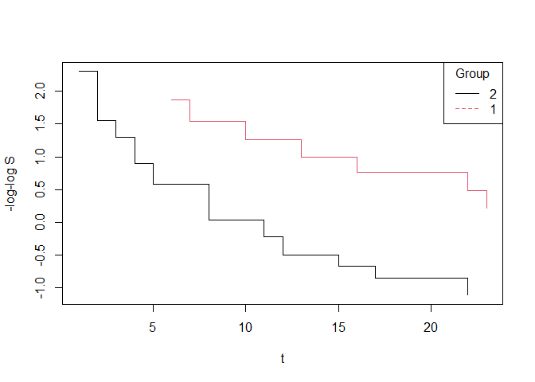
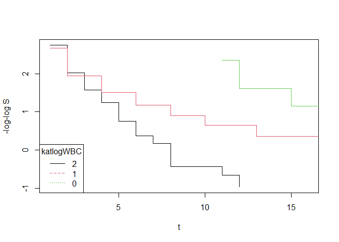

# Pembahasan Contoh Soal  

Instal package yang dibutuhkan

``` r
library(knitr)
library(readxl)
library(survival)
library(survminer)
library(coin)
library(car)
library(survMisc)
library(dplyr)
library(tidyr)
```

Contoh Soal 2.2
===============

### Import Data


``` r
data2.1 <-  read_excel("../data/AKH_Data contoh Soal.xlsx", sheet = "Contoh 2.1")
str(data2.1)
```

    ## tibble [42 x 3] (S3: tbl_df/tbl/data.frame)
    ##  $ Group : num [1:42] 1 1 1 1 1 1 1 1 1 1 ...
    ##  $ t     : num [1:42] 6 6 6 6 7 9 10 10 11 13 ...
    ##  $ Status: num [1:42] 1 1 1 0 1 0 1 0 0 1 ...

``` r
kable(head(data2.1))
```

|  Group|    t|  Status|
|------:|----:|-------:|
|      1|    6|       1|
|      1|    6|       1|
|      1|    6|       1|
|      1|    6|       0|
|      1|    7|       1|
|      1|    9|       0|

### Fungsi survival


``` r
data2.1$Group <- as.factor(data2.1$Group)
fit1 <- survfit(Surv(t, Status) ~ Group, data = data2.1)
summary(fit1)
```

    ## Call: survfit(formula = Surv(t, Status) ~ Group, data = data2.1)
    ## 
    ##                 Group=1 
    ##  time n.risk n.event survival std.err lower 95% CI upper 95% CI
    ##     6     21       3    0.857  0.0764        0.720        1.000
    ##     7     17       1    0.807  0.0869        0.653        0.996
    ##    10     15       1    0.753  0.0963        0.586        0.968
    ##    13     12       1    0.690  0.1068        0.510        0.935
    ##    16     11       1    0.627  0.1141        0.439        0.896
    ##    22      7       1    0.538  0.1282        0.337        0.858
    ##    23      6       1    0.448  0.1346        0.249        0.807
    ## 
    ##                 Group=2 
    ##  time n.risk n.event survival std.err lower 95% CI upper 95% CI
    ##     1     21       2   0.9048  0.0641      0.78754        1.000
    ##     2     19       2   0.8095  0.0857      0.65785        0.996
    ##     3     17       1   0.7619  0.0929      0.59988        0.968
    ##     4     16       2   0.6667  0.1029      0.49268        0.902
    ##     5     14       2   0.5714  0.1080      0.39455        0.828
    ##     8     12       4   0.3810  0.1060      0.22085        0.657
    ##    11      8       2   0.2857  0.0986      0.14529        0.562
    ##    12      6       2   0.1905  0.0857      0.07887        0.460
    ##    15      4       1   0.1429  0.0764      0.05011        0.407
    ##    17      3       1   0.0952  0.0641      0.02549        0.356
    ##    22      2       1   0.0476  0.0465      0.00703        0.322
    ##    23      1       1   0.0000     NaN           NA           NA

### Kurva KM (Ploting)


``` r
ggsurvplot(fit1, data = data2.1,ggtheme = theme_bw())
```



Contoh Soal 3.1
===============

### Uji Long-rank test


``` r
test <- survdiff(Surv(t, Status) ~ Group, data = data2.1)
test
```

    ## Call:
    ## survdiff(formula = Surv(t, Status) ~ Group, data = data2.1)
    ## 
    ##          N Observed Expected (O-E)^2/E (O-E)^2/V
    ## Group=1 21        9     19.3      5.46      16.8
    ## Group=2 21       21     10.7      9.77      16.8
    ## 
    ##  Chisq= 16.8  on 1 degrees of freedom, p= 4e-05

Kesimpulan: Dengan tingkat signifikansi 5%, terdapat perbedaan pola
fungsi survival antargroup

### Weigthting Test Statistik


``` r
logrank_test(Surv(t, Status) ~ Group, data = data2.1, type="Gehan-Breslow")
```

    ## 
    ##  Asymptotic Two-Sample Gehan-Breslow Test
    ## 
    ## data:  Surv(t, Status) by Group (1, 2)
    ## Z = 3.6071, p-value = 0.0003096
    ## alternative hypothesis: true theta is not equal to 1

*Catatan :*

1.  Hasilnya merupakan pendekatan (Berbeda dengan cara manual tapi tidak
    signifikan perbedaannya)
2.  Pilihan Tipe tes, type = c(“logrank”, “Gehan-Breslow”,
    “Tarone-Ware”,“Peto-Peto”, “Prentice”, “Prentice-Marek”,
    “Andersen-Borgan-Gill-Keiding”, “Fleming-Harrington”,
    “Gaugler-Kim-Liao”, “Self”)

Contoh Soal 5.1
===============

### Import data


``` r
data5.1 <- read_excel("../data/AKH_Data contoh Soal.xlsx", sheet = "Contoh 5.1")
kable(data5.1)
```

| subjek |  waktu|  status|   X1|
|:-------|------:|-------:|----:|
| B      |      2|       1|    1|
| C      |      5|       1|    0|
| A      |      7|       0|    0|
| D      |      8|       1|    1|

### Estimasi Parameter Cox-PH


``` r
data5.1$X1 <- as.factor(data5.1$X1)
model5.1 <- coxph(Surv(waktu,status)~X1, data = data5.1)
model5.1
```

    ## Call:
    ## coxph(formula = Surv(waktu, status) ~ X1, data = data5.1)
    ## 
    ##       coef exp(coef) se(coef)     z     p
    ## X11 0.3466    1.4142   1.4355 0.241 0.809
    ## 
    ## Likelihood ratio test=0.06  on 1 df, p=0.8096
    ## n= 4, number of events= 3

Jadi diperoleh *β*<sub>1</sub> = 0.3466  

Contoh Soal 5.2
===============

### Import data


``` r
data5.2 <-  read_excel("../data/AKH_Data contoh Soal.xlsx", sheet = "Contoh 5.2")
str(data5.2)
```

    ## tibble [42 x 4] (S3: tbl_df/tbl/data.frame)
    ##  $ Group : num [1:42] 1 1 1 1 1 1 1 1 1 1 ...
    ##  $ t     : num [1:42] 6 6 6 7 10 13 16 22 23 6 ...
    ##  $ status: num [1:42] 1 1 1 1 1 1 1 1 1 0 ...
    ##  $ logWBC: num [1:42] 2.31 4.06 3.28 4.43 2.96 2.88 3.6 2.32 2.57 3.2 ...

``` r
kable(head(data5.2))
```

|  Group|    t|  status|  logWBC|
|------:|----:|-------:|-------:|
|      1|    6|       1|    2.31|
|      1|    6|       1|    4.06|
|      1|    6|       1|    3.28|
|      1|    7|       1|    4.43|
|      1|   10|       1|    2.96|
|      1|   13|       1|    2.88|

### Model Cox\_PH


Model Group sebagai kovariate

``` r
data5.2$Group <- as.factor(data5.2$Group)
model5.2_Group <- coxph(Surv(t,status)~Group, data = data5.2)
model5.2_Group
```

    ## Call:
    ## coxph(formula = Surv(t, status) ~ Group, data = data5.2)
    ## 
    ##          coef exp(coef) se(coef)     z        p
    ## Group2 1.5721    4.8169   0.4124 3.812 0.000138
    ## 
    ## Likelihood ratio test=16.35  on 1 df, p=5.261e-05
    ## n= 42, number of events= 30

### Model Kategori logWBC sebagai kovariate


``` r
data5.2$katlogWBC <- factor(if_else(data5.2$logWBC<=2.3,0,if_else(data5.2$logWBC<=3,1,2)))  #kategorikkan LogWBC
model5.2_katlogWBC <- coxph(Surv(t,status)~katlogWBC, data = data5.2)
model5.2_katlogWBC
```

    ## Call:
    ## coxph(formula = Surv(t, status) ~ katlogWBC, data = data5.2)
    ## 
    ##               coef exp(coef) se(coef)     z       p
    ## katlogWBC1  1.3694    3.9331   0.5906 2.319  0.0204
    ## katlogWBC2  2.6360   13.9573   0.6292 4.189 2.8e-05
    ## 
    ## Likelihood ratio test=22.89  on 2 df, p=1.07e-05
    ## n= 42, number of events= 30

### Model Group dan kategori logWBC sebagai kovariate tanpa interaksi


``` r
model5.2_GroupkatlogWBC <- coxph(Surv(t,status)~Group+katlogWBC, data = data5.2)
model5.2_GroupkatlogWBC
```

    ## Call:
    ## coxph(formula = Surv(t, status) ~ Group + katlogWBC, data = data5.2)
    ## 
    ##               coef exp(coef) se(coef)     z        p
    ## Group2      1.3635    3.9099   0.4352 3.133 0.001728
    ## katlogWBC1  1.4103    4.0972   0.5976 2.360 0.018268
    ## katlogWBC2  2.3623   10.6155   0.6473 3.649 0.000263
    ## 
    ## Likelihood ratio test=33.77  on 3 df, p=2.212e-07
    ## n= 42, number of events= 30

### Model interaksi Group dan LogWBC


``` r
model5.2_GroupxkatkatlogWBC <- coxph(Surv(t,status)~Group*logWBC, data = data5.2)
model5.2_GroupxkatkatlogWBC
```

    ## Call:
    ## coxph(formula = Surv(t, status) ~ Group * logWBC, data = data5.2)
    ## 
    ##                  coef exp(coef) se(coef)      z       p
    ## Group2         2.7078   14.9968   1.6832  1.609   0.108
    ## logWBC         1.8139    6.1343   0.4440  4.086 4.4e-05
    ## Group2:logWBC -0.4249    0.6538   0.5219 -0.814   0.416
    ## 
    ## Likelihood ratio test=43.02  on 3 df, p=2.435e-09
    ## n= 42, number of events= 30

Contoh Soal 6.1
===============

### Tes Asumsi PH


#### Metode Grafik log(-log(s(t)))

*catatan*: Plotingannya merupakan pencerminan kurva
-log(-log(S(t)))terhadap sumbu-x (sumbu horisontal) sehingga
kesimpulannya sama melihat kesejajarannya tapi berbeda arah

``` r
#a
fit5.2_Group <- survfit(Surv(t,status)~Group, data = data5.2)
ggsurvplot(fit5.2_Group)
```



``` r
ggsurvplot(fit5.2_Group, fun = "cloglog")
```



Kurva sejajar : Asumsi proportional hazard terpenuhi pada kovariate
Group

``` r
#b
fit5.2_katlogWBC <- survfit(Surv(t,status)~katlogWBC, data = data5.2)
ggsurvplot(fit5.2_katlogWBC, fun = "cloglog")
```



#### kurva -log(-log(s(t)))

``` r
#a
sumfit5.2a <- summary(fit5.2_Group)
plot(sumfit5.2a$time[sumfit5.2a$strata=="Group=2"],
     -log(-log(sumfit5.2a$surv[sumfit5.2a$strata=="Group=2"])),
     type ="s", xlab = "t", ylab ="-log-log S" )
lines(sumfit5.2a$time[sumfit5.2a$strata=="Group=1"],
     -log(-log(sumfit5.2a$surv[sumfit5.2a$strata=="Group=1"])),
     type ="s", col=2)
legend("topright",legend = c("2","1"), col = 1:3 , lty = 1:3, title ="Group")
```



``` r
#b
sumfit5.2b <- summary(fit5.2_katlogWBC)
plot(sumfit5.2b$time[sumfit5.2b$strata=="katlogWBC=2"],
     -log(-log(sumfit5.2b$surv[sumfit5.2b$strata=="katlogWBC=2"])),
     type ="s", xlab = "t", ylab ="-log-log S" )
lines(sumfit5.2b$time[sumfit5.2b$strata=="katlogWBC=1"],
     -log(-log(sumfit5.2b$surv[sumfit5.2b$strata=="katlogWBC=1"])),
     type ="s", col=2)
lines(sumfit5.2b$time[sumfit5.2b$strata=="katlogWBC=0"],
     -log(-log(sumfit5.2b$surv[sumfit5.2b$strata=="katlogWBC=0"])),
     type ="s", col=3)
legend("bottomleft",legend = c("2","1","0"), col = 1:3, lty = 1:3, title ="katlogWBC")
```



### Uji Goodness of Fit


``` r
#a
cox.zph(model5.2_Group)
```

    ##         chisq df    p
    ## Group  0.0229  1 0.88
    ## GLOBAL 0.0229  1 0.88

``` r
#b
cox.zph(model5.2_katlogWBC)
```

    ##           chisq df    p
    ## katlogWBC 0.992  2 0.61
    ## GLOBAL    0.992  2 0.61

*Kesimpulan:* Dengan tingkat signifikansi 5%, untuk kedua model memenuhi
asumsi PH

Contoh 7.1
==========

Data cancer merupakan data yang berasala pada package survival

### Model sex+ph.karno+catage


``` r
data7.1 <- cancer[,c("time","status","sex","age","ph.karno")]
str(data7.1)
```

    ## 'data.frame':    228 obs. of  5 variables:
    ##  $ time    : num  306 455 1010 210 883 ...
    ##  $ status  : num  2 2 1 2 2 1 2 2 2 2 ...
    ##  $ sex     : num  1 1 1 1 1 1 2 2 1 1 ...
    ##  $ age     : num  74 68 56 57 60 74 68 71 53 61 ...
    ##  $ ph.karno: num  90 90 90 90 100 50 70 60 70 70 ...

``` r
data7.1$catage<- Recode(data7.1$age, "lo:47=1;48:71=2;72:hi=3") #mengkategorikan umur
data7.1$sex <- as.factor(data7.1$sex)
data7.1 <- na.omit(data7.1) #mengahpus observasi yang memiliki missing value
kable(head(data7.1))
```

|  time|  status| sex |  age|  ph.karno|  catage|
|-----:|-------:|:----|----:|---------:|-------:|
|   306|       2| 1   |   74|        90|       3|
|   455|       2| 1   |   68|        90|       2|
|  1010|       1| 1   |   56|        90|       2|
|   210|       2| 1   |   57|        90|       2|
|   883|       2| 1   |   60|       100|       2|
|  1022|       1| 1   |   74|        50|       3|

``` r
model7.1a<- coxph(Surv(time,status)~ catage + ph.karno + sex, data = data7.1)
cox.zph(model7.1a)
```

    ##          chisq df      p
    ## catage    2.35  1 0.1255
    ## ph.karno  7.93  1 0.0049
    ## sex       3.27  1 0.0705
    ## GLOBAL   10.70  3 0.0135

*Kesimpulan:* Variabel Ph,karno tidak memenuhi asumsi PH

### Model strata ph.karno


``` r
model7.1b <- coxph(Surv(time,status)~sex+strata(ph.karno)+catage, data = data7.1)
cox.zph(model7.1b)
```

    ##         chisq df    p
    ## sex    2.1090  1 0.15
    ## catage 0.0199  1 0.89
    ## GLOBAL 2.1123  2 0.35

Contoh 7.2
==========

### Model sex+ph.karno+strata(catage)


``` r
modelcancer1 <- coxph(Surv(time,status)~sex+ph.karno+strata(catage), data =data7.1)
modelcancer1
```

    ## Call:
    ## coxph(formula = Surv(time, status) ~ sex + ph.karno + strata(catage), 
    ##     data = data7.1)
    ## 
    ##               coef exp(coef)  se(coef)      z       p
    ## sex2     -0.509868  0.600575  0.167606 -3.042 0.00235
    ## ph.karno -0.014729  0.985378  0.005946 -2.477 0.01324
    ## 
    ## Likelihood ratio test=15.82  on 2 df, p=0.0003663
    ## n= 227, number of events= 164

``` r
modelcancer1$loglik[2]
```

    ## [1] -630.8648

### Model ph.karno+strata(catage)


``` r
modelcancer2 <- coxph(Surv(time,status)~ph.karno+strata(catage), data = data7.1)
modelcancer2
```

    ## Call:
    ## coxph(formula = Surv(time, status) ~ ph.karno + strata(catage), 
    ##     data = data7.1)
    ## 
    ##               coef exp(coef)  se(coef)      z      p
    ## ph.karno -0.015318  0.984798  0.006108 -2.508 0.0121
    ## 
    ## Likelihood ratio test=6.09  on 1 df, p=0.01356
    ## n= 227, number of events= 164

``` r
modelcancer2$loglik[2]
```

    ## [1] -635.7295

### tes apakah Sex berpengaruh pada model strata


``` r
pchisq(-2*modelcancer2$loglik[2]-(-2*modelcancer1$loglik[2]),1,lower.tail = F)
```

    ## [1] 0.001813408

*Kesimpulan :* Jenis kelamin berpengaruh pada model atau modelcancer1
lebih baik
